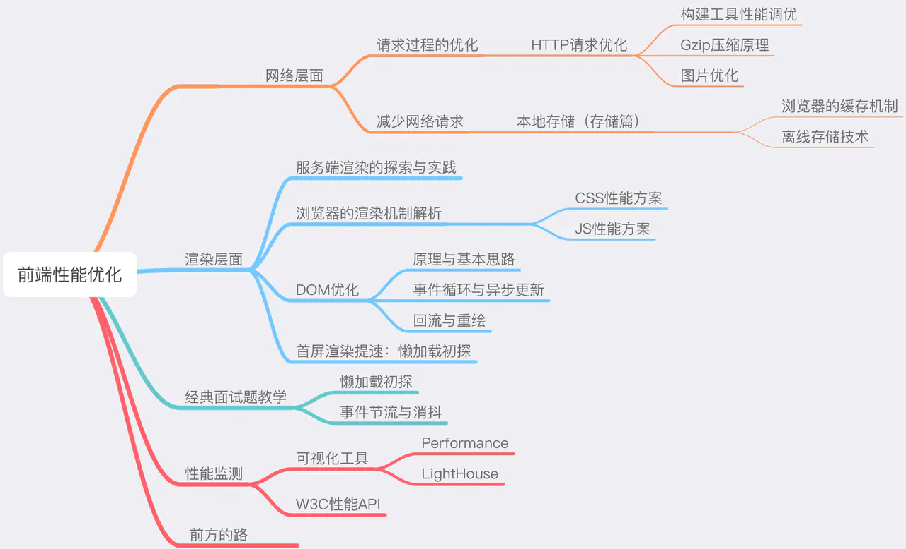

## this 指向问题

> 参考文章：https://juejin.cn/post/6844904083707396109

`this` 的几种绑定方式：

- 默认绑定：非严格模式下 `this` 指向全局对象，严格模式下 `this` 绑定到 `undefined`
- 隐式绑定：当函数引用有上下文对象时，指向该对象

  `this` 永远指向最后调用它的那个对象（不考虑箭头函数

- 显示绑定：通过 `call`，`apply`，`bind` 调用

  如果 `call`，`apply`，`bind` 接受到的第一个参数是空或者 `null`，`undefined` 时，则会忽略这个参数
  `forEach`, `map`, `filter` 函数的第二个参数也是能显示绑定 `this` 的

```javascript
var obj = {
  a: 1,
  foo: function (b) {
    b = b || this.a
    return function (c) {
      console.log(this.a + b + c)
    }
  },
}
var a = 2
var obj2 = { a: 3 }

obj.foo(a).call(obj2, 1)
obj.foo.call(obj2)(1)
// 6
// 6
```

- `new` 绑定

  通过 `new` 关键字形成的实例可以直接转换为对象

- 箭头函数绑定

  箭头函数内的 `this` 由外层作用域决定，且指向函数定义时的 `this` 而非执行时。
  作用域只有函数作用域和全局作用域
  箭头函数的 this 无法通过 `bind`，`call`，`apply` 来直接修改

> 此题对 _函数定义时，而非执行时_ 做出诠释

```javascript
var name = 'window'
function Person(name) {
  this.name = name
  this.foo1 = function () {
    console.log(this.name)
  }
  this.foo2 = () => {
    console.log(this.name)
  }
}
var person2 = {
  name: 'person2',
  foo2: () => {
    console.log(this.name)
  },
}
var person1 = new Person('person1')
person1.foo1()
person1.foo2()
person2.foo2()
```

## Event Loop

`Event Loop` 执行顺序

- 一开始整个脚本作为宏任务执行
- 执行过程中同步代码直接执行，宏任务进入宏任务队列，微任务进入微任务队列
- 直到当前宏任务执行完，检查微任务列表，有则依次执行，直到全部执行完
- 执行浏览器 UI 线程的渲染工作
- 检查是否有 `Web Worker` 任务，有则执行
- 执行完本轮的宏任务，回到 2，依次循环，知道宏任务和微任务列表都为空

宏任务: `script`, `setTimeOut`, `setInterval`, `setImmediate`, `I/O`, `UI rendering`

微任务：`Promise.then()或 catch()`, `process.nextTick`, `fetch API`, `V8`的垃圾回收

任何一个非 `Promise` 对象都会包裹成 `Promise` 对象

```javascript
Promise.resolve()
  .then(() => {
    return new Error('error!!!')
  })
  .then(res => {
    console.log('then: ', res)
  })
  .catch(err => {
    console.log('catch: ', err)
  })
// "then: " "Error:error!!"
```

`async/await` 与 `Promise` 的转换

async/await 代码

```javascript
async function async1() {
  console.log('async1 start')
  await async2()
  console.log('async1 end')
}
async function async2() {
  console.log('async2')
}
async1()
console.log('start')
```

Promise 代码

```javascript
async function async1() {
  console.log('async1 start')
  // 原来代码
  // await async2();
  // console.log("async1 end");

  // 转换后代码
  new Promise(resolve => {
    console.log('async2')
    resolve()
  }).then(res => console.log('async1 end'))
}
async function async2() {
  console.log('async2')
}
async1()
console.log('start')
```

`await` 后代码相当于 `Promise.then()`中的回调代码

## 原型关系图


## 继承

> https://github.com/mqyqingfeng/Blog/issues/16

**1. 原型链继承**

```javascript
function Parent() {
  this.name = 'kevin'
}

Parent.prototype.getName = function () {
  console.log(this.name)
}

function Child() {}

Child.prototype = new Parent()

var child1 = new Child()

console.log(child1.getName()) // kevin
```

**2. 借用构造函数继承**

```javascript
function Parent() {
  this.names = ['kevin', 'daisy']
}

function Child() {
  Parent.call(this)
}

var child1 = new Child()
var child2 = new Child()

child1.names.push('yayu')

console.log(child1.names) // ["kevin", "daisy", "yayu"]
console.log(child2.names) // ["kevin", "daisy"]
```

**3. 组合继承**

```javascript
function Parent(name) {
  this.name = name
  this.colors = ['red', 'blue', 'green']
}

Parent.prototype.getName = function () {
  console.log(this.name)
}

function Child(name, age) {
  Parent.call(this, name)

  this.age = age
}

Child.prototype = new Parent()
Child.prototype.constructor = Child

var child1 = new Child('kevin', '18')

child1.colors.push('black')

console.log(child1.name) // kevin
console.log(child1.age) // 18
console.log(child1.colors) // ["red", "blue", "green", "black"]

var child2 = new Child('daisy', '20')

console.log(child2.name) // daisy
console.log(child2.age) // 20
console.log(child2.colors) // ["red", "blue", "green"]
```

**4. 原型式继承**

```javascript
var person = {
  name: 'kevin',
  friends: ['daisy', 'kelly'],
}

var person1 = createObj(person)
var person2 = createObj(person)

person1.name = 'person1'
console.log(person2.name) // kevin

person1.friends.push('taylor')
console.log(person2.friends) // ["daisy", "kelly", "taylor"]
```

**5. 寄生式继承**

```javascript
function createObj(o) {
  var clone = Object.create(o)
  clone.sayName = function () {
    console.log('hi')
  }
  return clone
}
```

**6. 寄生组合式继承**

```javascript
function object(o) {
  function F() {}
  F.prototype = o
  return new F()
}

function prototype(child, parent) {
  var prototype = object(parent.prototype)
  prototype.constructor = child
  child.prototype = prototype
}

// 当我们使用的时候：
prototype(Child, Parent)
```

## 前端性能优化

- 网络层优化
  - DNS: 浏览器 DNS 缓存，DNS prefetch
  - TCP: 长链接
- webpack 性能优化
  - 不要让 babel 做太多事
  - 使用 tree-shaking 删除冗余代码，`UglifyJsPlugin`
  - 使用 gzip 压缩
- 图片质量优化
  - 使用雪碧图减少 http 请求
  - 使用 SVG 图片，体积小不失真
- 浏览器缓存策略
  - 强缓存：expires，cache-control
  - 协商缓存：Last-Modify，If-Nodify-Since，ETag，If-None-Match
- 本地缓存策略
  - cookie
  - localStorage
  - sessionStorage
  - indexDB
- 渲染过程
  - defer，async
  - 正确的 CSS 选择器
- 避免回流和重回 (回流必定会发生重绘，重绘不一定会引发回流。)
  - 让 DOM 离线
- 首屏优化
  - 懒加载图片
- 事件的防抖和截流



## 输入 URL 到页面加载完成 浏览器发生了什么事情


1. 域名解析 DNS

   1. 浏览器缓存，本地文件
   2. 向本地 DNS 服务器查询 （网络设置）
   3. 向根服务器 => com 域名服务器 => 子服务器 进行查询
   4. 返回 IP 地址

   浏览器 -> 系统 -> 路由器 -> ISP

2. 检查浏览器是否具有缓存

   - 强缓存
   - 协商缓存

3. 建立 TCP 连接

   - 三次握手

4. 是否为 HTTPS
5. 浏览器发送请求获取资源
6. 浏览器渲染

   1. 浏览器解析 HTML，CSS，JS，分别生产 DOM tree, CSS 规则树。
      字节数据 => 字符串 => Token => Node => DOM
   2. 解析完成后，通过 `DOM Tree` 和 `CSS Rule Tree` 树来构建 `Rendering Tree`
      通过不断回流，渲染 `Rendering Tree`
   3. 通过调用操作系统 Native GUI API 实现渲染
